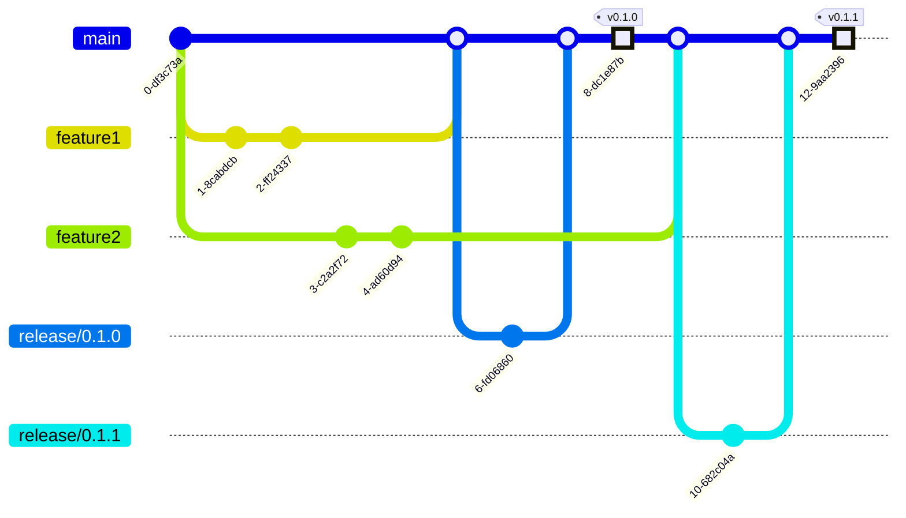

# Contribution Guideline

## Release

Below is the branching model:



### Release Branch

1. Create release branch `release/${VERSION}`
2. Increment version numbers in [`pyproject.toml`](pyproject.toml)
3. Build and push Docker image
   ```shell
   inv docker.push
   ```
4. Create pull request and merge it to `main` branch

### Git Tag and Release Note

- Create release tag
- [Generate GitHub release note automatically](https://docs.github.com/en/repositories/releasing-projects-on-github/automatically-generated-release-notes)
